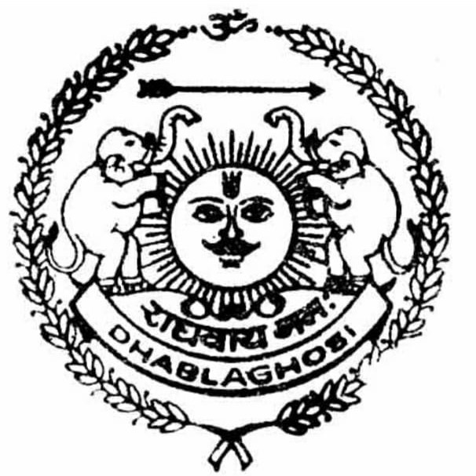

# Thikana Dhabla Ghosi - Badgujar Rajput Heritage Website

## 📖 Overview

Thikana Dhabla Ghosi is a static HTML website dedicated to preserving and showcasing the rich heritage of the Badgujar Rajput family from Thikana Dhabla Ghosi, Shajapur, Madhya Pradesh. This website serves as a digital archive of the royal family's history, genealogy, cultural traditions, and legacy.

## 🏰 About the Project

This website documents the glorious history of the Badgujar Rajputs, a distinguished Suryavanshi warrior clan tracing their lineage to Lava, the elder son of Bhagwan Shri Ram. The website features:

- **Royal History**: Detailed accounts of the Badgujar Rajput dynasty
- **Family Tree**: Complete genealogy from Raja Goga Dev to present generation
- **Location & Map**: Interactive map and directions to Thikana Dhabla Ghosi
- **Contact Form**: Easy way to connect with the family
- **Privacy Policy**: Comprehensive data protection information
- **Sitemap**: Complete site navigation structure

## 🌟 Features

### Core Pages
| Page | Description |
|------|-------------|
| `index.html` | Homepage with welcome message and introduction |
| `history.html` | Detailed history of Badgujar Rajputs and Dhabla Ghosi estate |
| `familytree.html` | Interactive family tree/genealogy visualization |
| `map.html` | Location information and Google Maps integration |
| `about.html` | About the creator and acknowledgements |
| `contactus.html` | Contact form with CAPTCHA protection |
| `privacy.html` | Privacy policy and data handling information |
| `sitemap.html` | Complete site navigation and sitemap downloads |

### Design Features
- **Rajasthani Color Palette**: Saffron, gold, maroon, and cream theme
- **Responsive Design**: Mobile-friendly layout for all devices
- **Circular Logo Frame**: Animated royal emblem
- **Blinking Message**: Rotating welcome messages (राघवाय नमः, जय माँ आसावरी)
- **Back to Top Button**: Easy navigation
- **Google Translate**: Multi-language support (English/Hindi)

### Interactive Elements
- Contact form with CAPTCHA validation
- Web3Forms integration for email submissions
- Google Maps embed for location
- Social media links (Instagram, Facebook, Email)
- Chatbase AI assistant integration

## 📁 Project Structure
